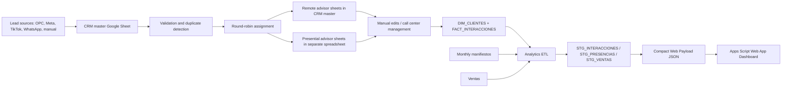

# BI Trigal Sur

Context date: 2026-06-11  
Owner workspace: local Windows workspace  
Google / clasp account: configure locally with `TRIGAL_CLASP_USER`

This repository contains the current operational code for the Trigal Sur commercial CRM, Analytics ETL, and Google Apps Script Web App dashboard.

The goal is to let a developer or another LLM understand the project without reading a long chat history.

## 1. Business Problem

Trigal Sur manages real-estate leads from multiple sources and needs a fast operational dashboard for:

- Call center supervision.
- Marketing performance.
- Commercial management.
- Lead quality, funnel conversion, advisors, districts, sources, appointments, tours and sales.

The previous analytics flow depended heavily on Google Sheets plus Looker Studio. The current direction is to keep Google Sheets as the operational database, but serve a custom Apps Script Web App dashboard with compact precomputed payloads for faster filtering and near-real-time analysis.

## 2. Canonical Project Structure

Only these folders are the current source of truth:

```text
apps_script/
  crm/
    .clasp.example.json
    .claspignore
    appsscript.json
    Code.js
    Sidebar.html

  analytics_etl/
    .clasp.example.json
    .claspignore
    appsscript.json
    Analytics_ETL.js
    DashboardWeb.js
    Dashboard.html
    DashboardClient.html
    DashboardStyles.html

  clasp_deploy_dashboard.cmd
  clasp_pull_all.cmd
  clasp_push_analytics.cmd
  clasp_push_crm.cmd
  clasp_status_all.cmd
  README_CLASP.md
```

Files in old backups or root-level historical copies are intentionally ignored by Git. They are not the canonical codebase.

## 3. Apps Script Projects

### CRM

Local path:

```text
apps_script/crm
```

Script ID:

```text
YOUR_CRM_APPS_SCRIPT_ID
```

Main files:

- `apps_script/crm/Code.js`
- `apps_script/crm/Sidebar.html`

The CRM:

- Reads and validates leads.
- Normalizes phone numbers and sources.
- Detects duplicates.
- Assigns leads by round-robin.
- Writes advisor sheets.
- Maintains `DIM_CLIENTES`.
- Maintains `FACT_INTERACCIONES`.
- Syncs manual edits from advisor sheets into the fact table.

### Analytics ETL + Dashboard Web

Local path:

```text
apps_script/analytics_etl
```

Script ID:

```text
YOUR_ANALYTICS_ETL_APPS_SCRIPT_ID
```

Main files:

- `Analytics_ETL.js`: ETL orchestration, staging, funnel logic, compact dashboard payload.
- `DashboardWeb.js`: Web App entrypoint, JSON actions, payload loading/saving.
- `Dashboard.html`: Web App shell.
- `DashboardClient.html`: browser-side dashboard calculations and charts.
- `DashboardStyles.html`: dashboard CSS.

## 4. Private IDs and Local Configuration

Real spreadsheet IDs, deployment IDs and Google account emails are intentionally not stored in this public repository.

For local `clasp`, copy each example file:

```text
apps_script/crm/.clasp.example.json -> apps_script/crm/.clasp.json
apps_script/analytics_etl/.clasp.example.json -> apps_script/analytics_etl/.clasp.json
```

Then fill the real Apps Script project IDs locally.

The CRM Apps Script must define these `ScriptProperties` or `DocumentProperties`:

```text
CRM_MASTER_ID
CRM_PRESENCIAL_ID
CRM_TIKTOK_ID
```

The Analytics ETL Apps Script must define these `ScriptProperties`:

```text
TRIGAL_CRM_ID
TRIGAL_VENTAS_ID
```

The local deployment scripts use these environment variables:

```text
TRIGAL_CLASP_USER
TRIGAL_DASHBOARD_DEPLOYMENT_ID
```

Example in Windows CMD:

```bat
set TRIGAL_CLASP_USER=your-google-account@example.com
set TRIGAL_DASHBOARD_DEPLOYMENT_ID=your-web-app-deployment-id
```

## 5. Data Flow



## 6. Advisor Base Routing

Advisor bases are split by modality.

Remote advisors stay in the CRM master:

- `DEBORA R.`
- `JACKY R.`
- `LADY G.`

Presential advisors live in the separate presential spreadsheet:

- `MARILYN P.`
- `EDITH P.`
- `ANDREA A.`

Routing is configured in `apps_script/crm/Code.js`:

- `CONFIG_SYSTEM.SPREADSHEETS.MASTER_ID`
- `CONFIG_SYSTEM.SPREADSHEETS.PRESENCIAL_ID`
- `CONFIG_SYSTEM.ADVISOR_BASES`

The presential file may include a sheet named `DATA_MAESTRA` for dropdowns. It is intentionally ignored by advisor-base logic via:

```js
CONFIG_SYSTEM.IGNORED_SHEETS = ['DATA_MAESTRA'];
```

Round-robin logic remains global. The base split only changes where advisor sheets are read/written.

## 7. CRM Fact Model

The main operational fact table is:

```text
FACT_INTERACCIONES
```

Core idea:

- Every lead assignment, call, manual edit, migration or relevant management event becomes a fact row.
- The CRM also keeps one lead dimension row in `DIM_CLIENTES`.
- Manual advisor edits sync back to `FACT_INTERACCIONES`.

Important action types:

- `ASIGNACION`
- `ASIGNACION_MANUAL`
- `LLAMADA`
- `EDICION_MANUAL`
- `MIGRACION`

The Analytics ETL treats `LLAMADA`, `EDICION_MANUAL` and `MIGRACION` as management events.

## 8. Funnel and Typification Logic

Raw CRM typifications are mapped into grouped typifications and then into funnel stages.

Important grouped labels include:

- `NO CONTESTA`
- `NO ASISTIO`
- `NO INTERESADO`
- `CITA CONFIRMADA`
- `APAGADO`
- `NO CALIFICA`
- `VOLVER A LLAMAR`
- `DATO FALSO`
- `INFO. WHATSAPP`
- `FUERA DE SERVICIO`
- `SEGUIMIENTO`
- `CITA HP`
- `CITA PROYECTO`
- `CITA HOY`
- `CITA ZOOM`
- `ASISTIO`

Additional mapping decisions:

- `GW` maps to `INFO. WHATSAPP`.
- `CZ` maps to `CITA ZOOM`.
- `NEX/FS` maps to `FUERA DE SERVICIO`.
- `ASISTIO` is considered a useful signal but not the primary source of presence; real presences come from manifiestos.

The commercial funnel is:

```text
Leads -> Contactables -> Potenciales -> Citas reales -> Presencias -> Tours validos -> Separaciones -> Procesables
```

## 9. Analytics ETL

The ETL lives in:

```text
apps_script/analytics_etl/Analytics_ETL.js
```

Current performance-focused settings:

```js
CFG.ETL.TRIGGER_CADA_MINUTOS = 15;
CFG.ETL.FUENTES_EXTERNAS_TTL_MINUTES = 60;
CFG.ETL.DASHBOARD_EVENT_SCOPE = 'ALL';
CFG.ETL.GENERAR_TIPIF_DIA_EN_CADENA = false;
CFG.ETL.ESCRIBIR_DASH_SHEETS = false;
```

Why:

- Dashboard should update more frequently.
- Presences and sales are expensive to read from external sheets, so they are refreshed only when stale.
- CRM interactions are the most time-sensitive source and are refreshed by the fast dashboard ETL.
- Heavy historical report sheets should not block the Web App dashboard.

Main fast dashboard function:

```js
runETL_DashboardRapido()
```

What it does:

1. Reads current CRM fact/dim data.
2. Writes/updates `STG_INTERACCIONES`.
3. Uses `STG_PRESENCIAS` and `STG_VENTAS` if still fresh.
4. Refreshes external sources only when TTL expires or STG is missing.
5. Builds and publishes compact Web App payload JSON.

Main full ETL entrypoint:

```js
runETL_Completo()
```

Use the full ETL for heavier report-table regeneration, not for routine dashboard refreshes.

## 10. Dashboard Web App

Dashboard server-side code:

```text
apps_script/analytics_etl/DashboardWeb.js
```

Dashboard client-side code:

```text
apps_script/analytics_etl/DashboardClient.html
```

Key Web App actions:

```text
?action=payloadHealth
?action=debugSummary
?action=debugData
?action=publishWebPayload
?action=health
```

Current dashboard modules:

- Resumen Ejecutivo
- Comercial
- Marketing
- Call Center
- Alertas
- Calidad ETL

Important UX/data behavior:

- `Cohorte` means "follow leads whose base date is inside the selected range".
- `Evento real` means "count events that happened inside the selected range".
- For activity today, use:

```text
Analisis = Evento real
Tipo de evento = GESTION
Fecha = today to today
```

Recent fix:

- The dashboard used to show `Evento real` while still calculating many KPIs from the lead cohort.
- This was corrected in deployment version `30`.
- The refresh button now schedules the fast ETL, polls for a newer payload, preserves filters, and then repaints.

## 11. Operating With Clasp

The expected Google account is local/private and should be configured as:

```text
TRIGAL_CLASP_USER
```

Check status:

```bat
apps_script\clasp_status_all.cmd
```

Push CRM:

```bat
apps_script\clasp_push_crm.cmd
```

Push Analytics ETL:

```bat
apps_script\clasp_push_analytics.cmd
```

Deploy dashboard:

```bat
apps_script\clasp_deploy_dashboard.cmd
```

The local `.clasp.json` files contain Apps Script project IDs. The OAuth credential file `.clasprc.json` is not in this repository and must not be committed.

## 12. GitHub Notes

Repository:

```text
https://github.com/Jorgelinher/BI---TRIGAL
```

Git author email should be configured locally. Avoid committing operational account emails or private Drive/App Script IDs.

This repository intentionally excludes:

- Local backups.
- Old root-level script copies.
- Local OAuth credentials.
- `.clasp.json` files with real Apps Script IDs.
- Portfolio/documentation drafts not needed for current operations.

## 13. Current Known Risks / Next Improvements

- Apps Script can still hit time limits when reading large Google Sheets, especially external manifiestos.
- Best next architecture for scale is: Cloud Scheduler + Cloud Run/Functions + Sheets API or BigQuery.
- Colab is not recommended for production scheduling because sessions are temporary.
- If payload size grows too much, split event payloads by month or serve date-range chunks.
- `FACT_INTERACCIONES` quality depends on advisor/manual edit sync being healthy.
- Presences should continue to come from manifiestos as source of truth, with CRM typification `ASISTIO` only as a fallback signal.

## 14. Quick Mental Model For New Developers / LLMs

If fixing CRM behavior, start in:

```text
apps_script/crm/Code.js
```

If fixing pipeline/data freshness, start in:

```text
apps_script/analytics_etl/Analytics_ETL.js
```

If fixing Web App actions or payload loading, start in:

```text
apps_script/analytics_etl/DashboardWeb.js
```

If fixing dashboard filters, calculations or charts, start in:

```text
apps_script/analytics_etl/DashboardClient.html
```

If fixing layout or styling, start in:

```text
apps_script/analytics_etl/DashboardStyles.html
```
